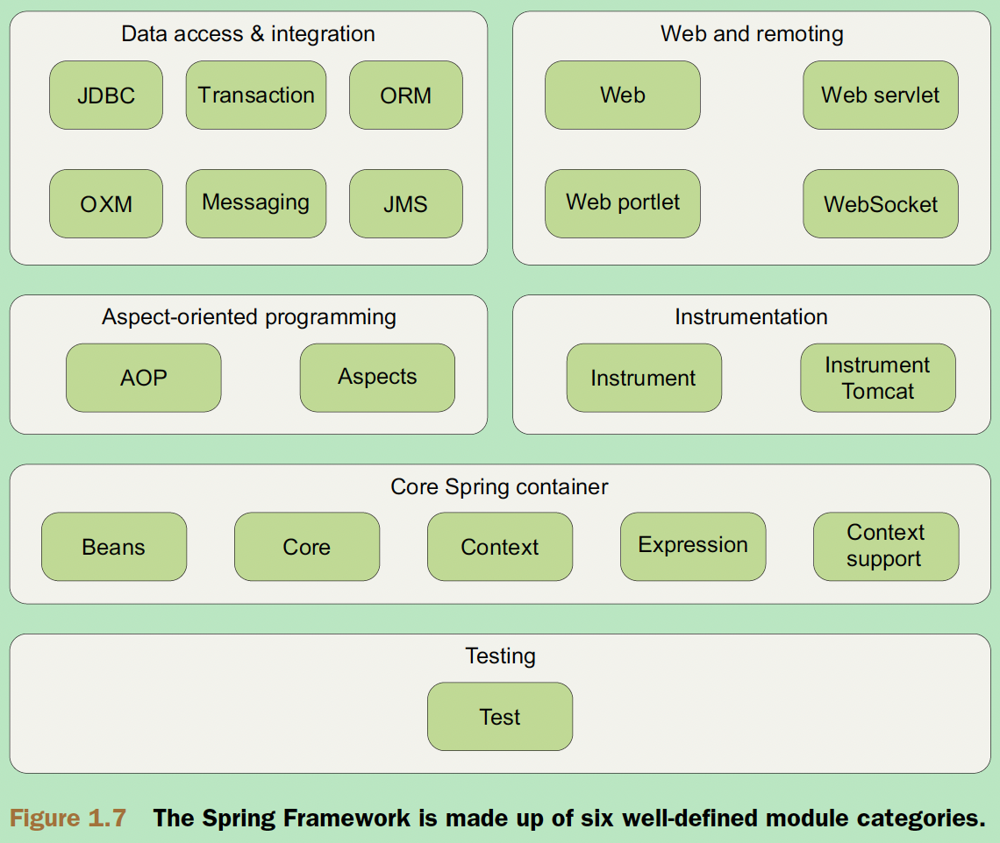

# Ch01 Overview

## 1.1 Why use Spring

Simplifying Java Development

- __Lightweight and minimally invasive__ development with _POJOs_
- __Loose coupling__ through _DI and interface_ orientation
- Declarative programming through aspects and common conventions
- Eliminating boilerplate code with aspects and templates

Examples

- BraveKnight.java
- Minstrel.java

## 1.2 Containing your beans

BeanFactory and ApplicationContext

### 1.2.1 BeanFactory

- uses DI to manage the components that make up an application

### 1.2.2 ApplicationContext

- build on the notion of a bean factory by providing application-framework services

### 1.2.3 A bean's life

## 1.3 Spring landscape

