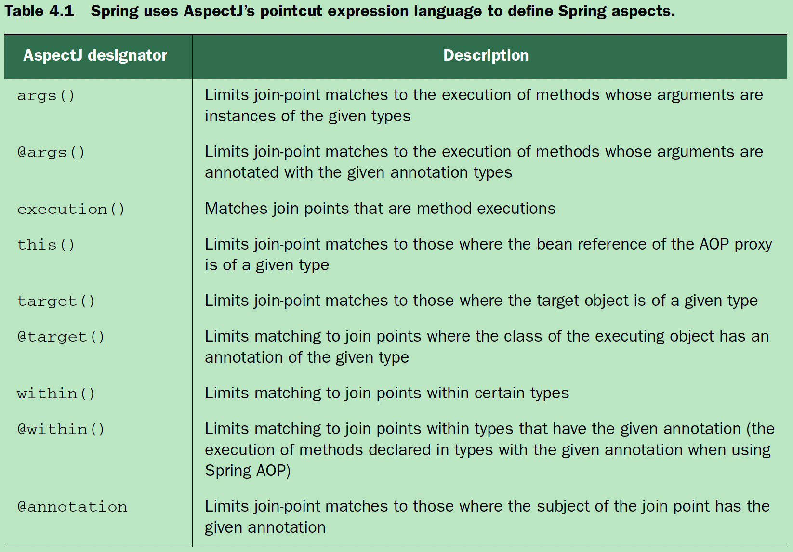

# Ch04 Aspect Oriented Spring

## 4.0 Content

- Basics of aspect-oriented programming
- Creating aspects from POJOs
- Using @AspectJ annotations
- Injecting dependencies into AspectJ aspects

## 4.1 Why need aspect?

In software development, functions that span multiple points of an application are called __cross-cutting concerns__. Typically, these cross-cutting concerns are conceptually separate from (but often embedded directly within) the application’s business logic.
Separating these cross-cutting concerns from the business logic is where aspect oriented programming (AOP) goes to work.
Whereas DI helps you decouple application objects from each other, AOP helps you decouple cross-cutting concerns from the objects they affect.

## 4.2 When / Where

- Logging
- Transaction
- Security
- Cache

### 4.2.1 Three methods to reuse common functionality

- Inheritance
- Delegation
- AOP

## 4.3 What

### 4.3.1 Defining AOP terminology

- Advice : advice contains the cross-cutting behavior that needs to be applied to an application’s objects.
- Join-Point : The join points are all the points within the execution flow of the application that are candidates to have advice applied.
- Pointcut : The pointcut defines where (at what join points) that advice is applied. The key concept is that pointcuts define which join points get advised.
- Aspect : Advice + PointCut
- Introduction : An introduction allows you to add new methods or attributes to existing classes.
- Weaving : Weaving is the process of applying aspects to a target object to create a new proxied object.
  - Compile time
  - Class load time
  - Runtime : Spring AOP

### 4.3.2 Writing PointCut



### 4.3.3 Writing Aspect

```java
@Configuration
@ComponentScan
@EnableAspectJAutoProxy
public class ConcertConfig {
    @Bean
    public Audience audience() {
        return new Audience();
    }
}

@Aspect
public class Audience {

  @Pointcut("execution(* cloud.*.concert.Performance.perform())")
  public void performance() {}

  @Around("performance()")
  public void watchPerformance(ProceedingJoinPoint joinPoint) {
    try {
      System.out.println("Around before performance");
      joinPoint.proceed();
      System.out.println("Around after performance");
    } catch (Throwable throwable) {
      System.out.println("Around exception");
    }
  }
}
```

### 4.3.4 Writing aspect with parameters

```java
@Aspect
public class TrackCounter {

    private Map<Integer, Integer> trackCounts = new HashMap<>();

    @Pointcut("execution(* cloud.popples.aop.soundsystem.CompactDisc.playTrack(int)) " + "&& args(trackNumber)")
    public void trackPlayed(int trackNumber) {}

    @Before("trackPlayed(trackNumber)")
    public void countTracks(int trackNumber) {
        int playCount = getPlayCount(trackNumber);
        trackCounts.put(trackNumber, playCount+1);
    }

    public int getPlayCount(int trackNumber) {
        return trackCounts.getOrDefault(trackNumber, 0);
    }

}
```

### 4.3.5 Injecting AspectJ aspects

AspectJ offers many types of pointcuts that
aren’t possible with Spring AOP : Constructor pointcuts