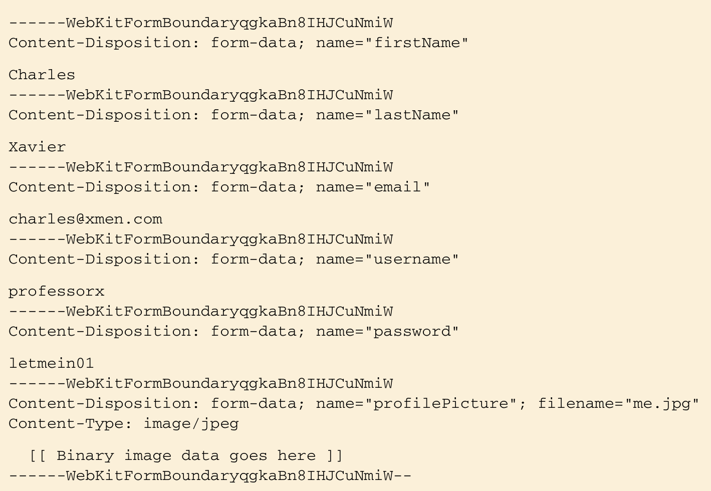

# 7. Advanced Spring MVC

- Alternative Spring MVC configuration options
- Handle file uploads
- Handle exceptions in controllers
- Carrying data across redirect requests

## 7.1 Alternate Spring MVC configuration

## 7.1.1 Customizing DispatcherServlet configuration

Method1 : AbstractAnnotationConfigDispatcherServletInitializer.customizeRegistration(Dynamic registration)

```java
@Override
protected void customizeRegistration(Dynamic registration) {
    registration.setMultiPartConfig(
            new MultipartConfigElement("/tmp/spittr/uploads")
    );
}
```

### 7.1.2 Adding additional servlets and filters

If you need to register any additional components into the web container, you need only create a new initializer class. The easiest way to do this is by implementing Spring’s WebApplicationInitializer interface.

```java
public class MyServletInitializer implements WebApplicationInitializer {
    @Override
    public void onStartup(ServletContext servletContext) throws ServletException {
        Registration.Dynamic myServlet = servletContext.addServlet("myServlet", MyServlet.class);
        myServlet.addMapping("/custom/**");
    }
}
```

Two methods to add Filters

```java
public class MyFilterInitializer implements WebApplicationInitializer {
    @Override
    public void onStartup(ServletContext servletContext) throws ServletException {
        Registration.Dynamic myFilter = servletContext.addFilter("myFilter", MyFilter.class);
        myFilter.addMappingForUrlPatterns(null, false, "custom/*");
    }
}
```

To register one or more filters and map them to DispatcherServlet, all you need to do is override the getServletFilters() method of AbstractAnnotationConfigDispatcherServletInitializer.

```java
@Override
protected Filter [] getServletFilters() {
    return new Filter [] {
            new MyFilter()
    };
}
```

## 7.2 Processing multipart form data



### 7.2.1 Configure multipart resolver

Add MultipartResolver bean

```java
@Bean
public MultipartResolver multipartResolver() throws IOException {
    return new StandardServletMultipartResolver();
}
```

Use Registration.Dynamic.setMultipartConfig(MultipartConfigElement)

```java


// method1 : When using servlet class implement WebApplicationInitializer
@Override
public void onStartup(ServletContext servletContext) throws ServletException {
    DispatcherServlet ds = new DispatcherServlet();
    Dynamic registration = context.addServlet("appServlet", ds);
    registration.addMapping("/");
    registration.setMultipartConfig(new MultipartConfigElement(
            "/tmp/spittr/uploads", 2 * 1024 * 1024, 4 * 1024 * 1024, 0));
}

// method2 : When using AbstractAnnotationConfigDispatcherServletInitializer
@Override
protected void customizeRegistration(Dynamic registration) {
    registration.setMultipartConfig(new MultipartConfigElement(
            "/tmp/spittr/uploads", 2 * 1024 * 1024, 4 * 1024 * 1024, 0));
}

```


### 7.2.2 Handling multipart requests

```java
// Method1 : MultipartFile
@RequestMapping(value = "/register", method = POST)
public String processRegistration(
        @Valid Spitter spitter, @RequestPart("profilePicture") MultipartFile profilePicture, BindingResult result) {
}

public interface MultipartFile {
    String getName();
    String getOriginalFilename();
    String getContentType();
    boolean isEmpty();
    long getSize();
    byte[] getBytes() throws IOException;
    InputStream getInputStream() throws IOException;
    void transferTo(File dest) throws IOException;
}


// Method2 : Part (No need MultipartConfig)
@RequestMapping(value = "/register", method = POST)
public String processRegistration(
        @Valid Spitter spitter, @RequestPart("profilePicture") Part profilePicture, BindingResult result) {
}

public interface Part {
    public InputStream getInputStream() throws IOException;
    public String getContentType();
    public String getName();
    public String getSubmittedFileName();
    public long getSize();
    public void write(String fileName) throws IOException;
    public void delete() throws IOException;
    public String getHeader(String name);
    public Collection<String> getHeaders(String name);
    public Collection<String> getHeaderNames();
}
```

## 7.3 Handle Exceptions

### 7.3.1 Mapping exception into HttpStatus

```java
@ResponseStatus(value = HttpStatus.NOT_FOUND, reason = "Spittle Not Found")
public class SpittleNotFoundException extends RuntimeException {
}
```

### 7.3.2 Handle Exception with Message

Now we can map any kind of exception into a status code, but cannot handle with messages(redirect pages ...). So we need @ExceptionHandler.
Note : @ExceptionHandler just effected in the Controller class.

```java
// Just in the Controller class
@RequestMapping("/")
@Controller
public class SpittleController {

    @RequestMapping(value = "/spittles/{spittleId}", method = GET)
    public String spittle(@PathVariable(value = "spittleId") Long id,
                          Model model) {
        Spittle spittle = spittleRepository.findOne(id);
        if (spittle == null) {
            throw new SpittleDuplicateException();
        }
        model.addAttribute("spittle", spittle);
        return "spittle";
    }

    @ExceptionHandler(SpittleDuplicateException.class)
    public String handleDuplicateSpittle() {
        return "error/duplicate";
    }
}
```

### 7.3.3 Handle Exception together

We want to use the code for handling a kind of Exception in the entire application.

```java
@Configuration
@ControllerAdvice
public class WebWideExceptionHandler {
    @ExceptionHandler(SpittleDuplicateException.class)
    public String handleException(final Exception ex, final WebRequest request) {
        return "error/duplicate";
    }
}
```

## 7.4 Carrying data across redirect requests

When a controller method results in a redirect, the original request ends and a new HTTP GET request begins. Any model data carried in the original request dies with the request.
- Passing data as path variables and/or query parameters using URL templates
- Sending data in flash attributes

### 7.4.1 Redirecting with URL templates

```java
@RequestMapping(value = "/register", method = POST)
public String processRegistration(
        @RequestPart("profilePicture") MultipartFile profilePicture,
        @Valid Spitter spitter,  BindingResult result, RedirectAttributes model) {
    if (result.hasErrors()) {
        return "registerForm";
    }
    Spitter saved = repository.save(spitter);

    model.addAttribute("username", saved.getUsername());
    model.addAttribute("id", saved.getId());

    return "redirect:/spitter/{username}";
}
```

> generate url : http://localhost:8080/spring07/spitter/fwefwegwe?id=1

### 7.4.2 Working with flash attributes

How to transfer complex objects after redirect request
- One option is to put the Spitter into the session.

```java
@RequestMapping(value = "/register", method = POST)
public String processRegistration(
        @RequestPart("profilePicture") MultipartFile profilePicture,
        @Valid Spitter spitter,  BindingResult result, RedirectAttributes model) {
    if (result.hasErrors()) {
        return "registerForm";
    }
    Spitter saved = repository.save(spitter);

    model.addAttribute("username", saved.getUsername());
    model.addAttribute("id", saved.getId());

    model.addFlashAttribute("spitter", saved);

    return "redirect:/spitter/{username}";
}
```