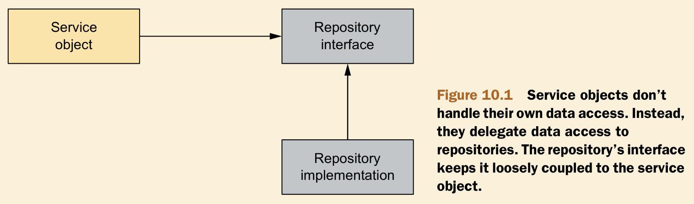
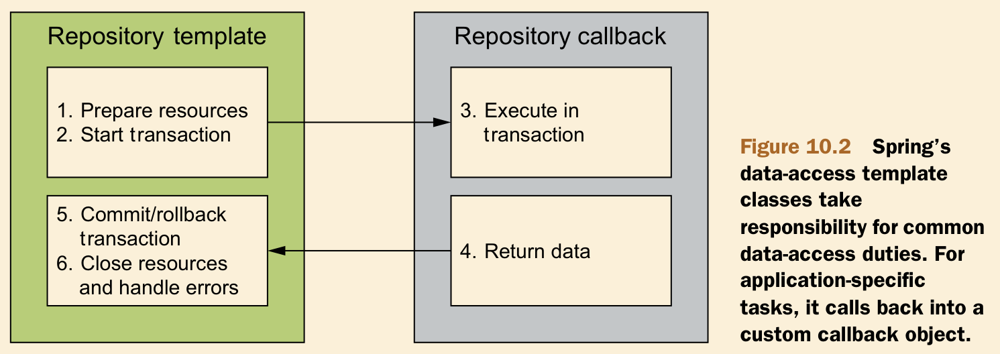

# Ch10 Hitting database with Spring and JDBC

- Defining Spring's database-access
- Configure database resources
- Working with Spring JDBC Template

## 10.1 Spring data access philosophy



- Decouple the application apart from particular data-access implementation
- Expose repository behavior through interface
- Provide a consistent exception hierarchy for all persistence option

Advantages

1. First, it makes your service objects easily testable, because they’re not coupled to a specific data-access implementation. 
2. In addition, the data-access tier is accessed in a persistence technology–agnostic manner. The chosen persistence approach is isolated to the repository, and only the relevant data-access methods are exposed through the interface. 
3. Avoid exceptions in persistence framework coupling with application components. (particular and unchecked exception)

Templates



Templates manage the fixed part of the process, whereas your custom data-access code is handled in callbacks.

- Template : Spring’s template classes handle the fixed parts of data access—controlling transactions, managing resources, and handling exceptions.
- Callback : specifics of data access -- creating statements, binding parameters, and marshaling result sets—are handled in the callback implementation.

## 10.2 Configuring a data source

- Data sources that are defined by a JDBC driver
- Data sources that are looked up JNDI
- Data sources that pool connections

## 10.2.1 Using JNDI data sources

J2EE application servers (Tomcat, JBoss) allow you to configure data sources to be retrieved via JNDI.

Benefits:

- Data sources can be managed completely external to the application
- Data sources managed in application server are often pooled for greater performance and can be hot-swapped by system administrators.

```xml
<Resource name="jdbc/SpitterDS" auth="Container"
               type="javax.sql.DataSource"
               maxTotal="1000" 
               maxWaitMillis="10000"
               driverClassName="com.mysql.jdbc.Driver" 
               username="root"
               password="123456" 
               url="jdbc:mysql://127.0.0.1:3306/spitter?useUnicode=true&amp;characterEncoding=UTF-8&amp;serverTimezone=Asia/Shanghai&amp;useSSL=false" />
```

## 10.2.2 Using a pooled data source

For qa and prod profile

## 10.2.3 Using JDBC driver-based data sources

## 10.2.4 Using an embedded data source

perfect choice for dev and test

## 10.2.5 Using profiles to select a data source

```java
@Configuration
public class DataSourceConfig {

    @Bean
    @Profile("prod")
    public DataSource prodDataSource() {
        JndiObjectFactoryBean jndiObjectFactoryBean = new JndiObjectFactoryBean();
        jndiObjectFactoryBean.setJndiName("jdbc/SpitterDS");
        jndiObjectFactoryBean.setResourceRef(true);
        jndiObjectFactoryBean.setProxyInterface(DataSource.class);
        return (DataSource) jndiObjectFactoryBean;
    }

    @Bean
    @Profile("qa")
    public DataSource qaDataSource() throws PropertyVetoException {
        ComboPooledDataSource dataSource = new ComboPooledDataSource();
        dataSource.setDriverClass("com.mysql.jdbc.Driver");
        dataSource.setJdbcUrl("jdbc:mysql://127.0.0.1:3306/spittr?useUnicode=true&characterEncoding=UTF-8&serverTimezone=Asia/Shanghai&useSSL=false");
        dataSource.setUser("root");
        dataSource.setPassword("123456");
        dataSource.setInitialPoolSize(5);
        dataSource.setMaxPoolSize(10);
        return dataSource;
    }

    @Bean
    @Profile("default")
    public DataSource dataSource() {
        DriverManagerDataSource dataSource = new DriverManagerDataSource();
        dataSource.setDriverClassName("com.mysql.jdbc.Driver");
        dataSource.setUrl("jdbc:mysql://127.0.0.1:3306/spittr?useUnicode=true&characterEncoding=UTF-8&serverTimezone=Asia/Shanghai&useSSL=false");
        dataSource.setUsername("root");
        dataSource.setPassword("123456");
        return dataSource;
    }

    @Bean
    @Profile("dev")
    public DataSource devDataSource() {
        return new EmbeddedDatabaseBuilder()
                .setType(EmbeddedDatabaseType.H2)
                .addScript("classpath:schema.sql")
                .addScript("classpath:test-data.sql")
                .build();
    }

}
```

## 10.3 Using JDBC with Spring

### 10.3.1 Configure JDBCTemplate

```java
@Bean
public JdbcTemplate jdbcTemplate(DataSource dataSource) {
    return new JdbcTemplate(dataSource);
}
```

### 10.3.2 Injecting JDBCTemplate

```java
@Repository
public class JdbcSpitterRepository implements SpitterRepository {

    private JdbcOperations jdbcOperations;

    @Autowired
    public JdbcSpitterRepository(JdbcOperations jdbcOperations) {
        this.jdbcOperations = jdbcOperations;
    }
}
```

### 10.3.3 CRUD in JDBCTemplate

create

```java
@Override
public void addSpitter(Spitter spitter) {
    jdbcOperations.update(SQL_INSERT_SPITTER,
            spitter.getUsername(),
            spitter.getPassword(),
            spitter.getFullName()
    );
}
```

search

```java
@Override
public Spitter findOne(long id) {
    Spitter spitter = jdbcOperations.queryForObject(
            SQL_SEARCH_SPITTER,
            (resultSet, rowNum) -> {
                Spitter temp = new Spitter();
                String fullName = resultSet.getString("fullName");
                temp.setId(resultSet.getLong("id"));
                temp.setUsername(resultSet.getString("username"));
                temp.setFirstName(fullName);
                return temp;
            },
            id);
    return spitter;
}
```

update

```java
@Override
public void updateSpitter(Spitter spitter) {
    jdbcOperations.update(SQL_UPDATE_SPITTER,
            spitter.getUsername(),
            spitter.getPassword(),
            spitter.getFullName(),
            spitter.getId()
    );
}
```