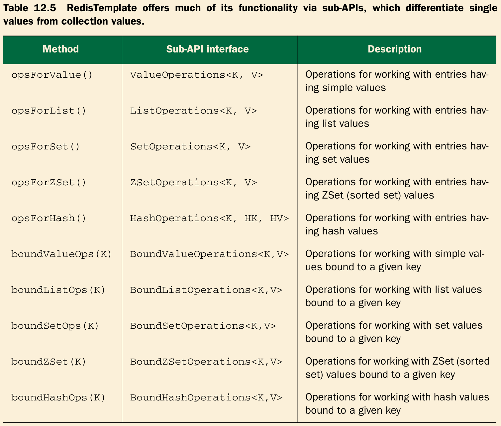

# Ch13 Working with NoSQL

## 12.3 Working with key-value data in Redis

```xml
<dependency>
    <groupId>redis.clients</groupId>
    <artifactId>jedis</artifactId>
    <version>2.5.2</version>
</dependency>

<dependency>
    <groupId>org.springframework.data</groupId>
    <artifactId>spring-data-redis</artifactId>
    <version>1.3.2.RELEASE</version>
</dependency>

<dependency>
    <groupId>com.fasterxml.jackson.core</groupId>
    <artifactId>jackson-databind</artifactId>
    <version>2.4.1.3</version>
</dependency>
```

### 12.3.1 Connecting to Redis

JedisConnectionFactory + RedisTemplate

```java
@Configuration
public class RedisConfig {

    @Bean
    public RedisConnectionFactory redisConnectionFactory() {
        JedisConnectionFactory factory = new JedisConnectionFactory();
        factory.setHostName("localhost");
        factory.setPort(6379);
        return factory;
    }

    @Bean
    public RedisTemplate<String, Product> redisTemplate(RedisConnectionFactory factory) {
        RedisTemplate<String, Product> redisTemplate = new RedisTemplate<>();
        redisTemplate.setConnectionFactory(factory);
        redisTemplate.setKeySerializer(new StringRedisSerializer());
        redisTemplate.setValueSerializer(new Jackson2JsonRedisSerializer<>(Product.class));
        return redisTemplate;
    }
}
```

### 12.3.2 Working with RedisTemplate



```java
@Test
public void workingWithLists() {
    Product product = new Product();
    product.setSku("9781617291203");
    product.setName("Spring in Action");
    product.setPrice(39.99f);

    Product product2 = new Product();
    product2.setSku("9781935182436");
    product2.setName("Spring Integration in Action");
    product2.setPrice(49.99f);

    Product product3 = new Product();
    product3.setSku("9781935182955");
    product3.setName("Spring Batch in Action");
    product3.setPrice(49.99f);

    redisTemplate.opsForList().rightPush("cart", product);
    redisTemplate.opsForList().rightPush("cart", product2);
    redisTemplate.opsForList().rightPush("cart", product3);

    Assert.assertEquals(3, redisTemplate.opsForList().size("cart").longValue());

    Product first = redisTemplate.opsForList().leftPop("cart");
    Product last = redisTemplate.opsForList().rightPop("cart");

    Assert.assertEquals(product.getSku(), first.getSku());
    Assert.assertEquals(product.getName(), first.getName());
    Assert.assertEquals(product.getPrice(), first.getPrice(), 0.005);

    Assert.assertEquals(product3.getSku(), last.getSku());
    Assert.assertEquals(product3.getName(), last.getName());
    Assert.assertEquals(product3.getPrice(), last.getPrice(), 0.005);

    Assert.assertEquals(1, redisTemplate.opsForList().size("cart").longValue());
}
```

### Setting key and value serializers

```java
// RedisConfig.java
@Bean
public RedisTemplate<String, Product> redisTemplate(RedisConnectionFactory factory) {
    RedisTemplate<String, Product> redisTemplate = new RedisTemplate<>();
    redisTemplate.setConnectionFactory(factory);
    redisTemplate.setKeySerializer(new StringRedisSerializer());
    redisTemplate.setValueSerializer(new Jackson2JsonRedisSerializer<>(Product.class));
    return redisTemplate;
}

// Test
@Test
public void settingKeyAndValueSerializers() {

    Product product = new Product();
    product.setSku("9781617291203");
    product.setName("Spring in Action");
    product.setPrice(39.99f);

    redisTemplate.opsForValue().set(product.getSku(), product);

    Product found = redisTemplate.opsForValue().get(product.getSku());
    Assert.assertEquals(product.getSku(), found.getSku());
    Assert.assertEquals(product.getName(), found.getName());
    Assert.assertEquals(product.getPrice(), found.getPrice(), 0.005);

    StringRedisTemplate stringRedis = new StringRedisTemplate(redisConnectionFactory);
    String json = stringRedis.opsForValue().get(product.getSku());
    Assert.assertEquals("{\"sku\":\"9781617291203\",\"name\":\"Spring in Action\",\"price\":39.99}", json);
}
```
