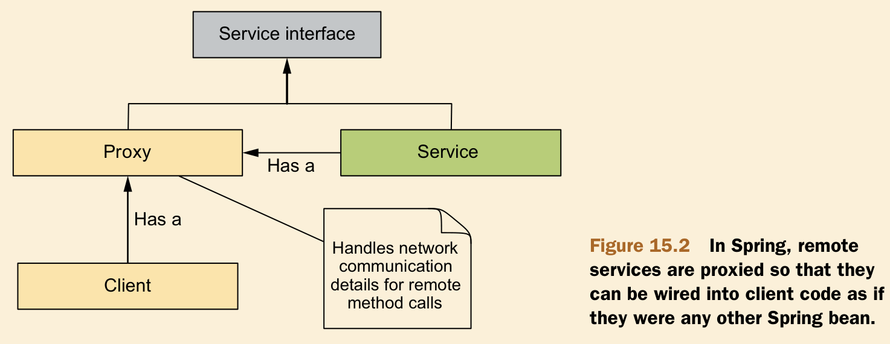
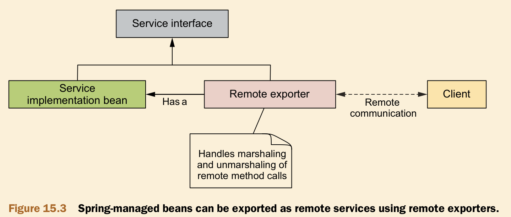

# Ch15 Working with Remote Services

## 15.1 An overview of Spring remoting

The conversation between the other applications and Spittr begins with a remote procedure call (RPC) from the client applications. On the surface, an RPC is similar to a call to a method on a local object. Both are synchronous operations, blocking execution in the calling code until the called procedure is complete.




## 15.4 Using Spring HttpInvoker

Server Config
- Exporter + HandlerMapping

```java
@Configuration
public class HttpInvokeServerConfig {

    @Bean
    public HttpInvokerServiceExporter httpInvokerServiceExporter(SpitterService spitterService) {
        HttpInvokerServiceExporter httpInvokerServiceExporter = new HttpInvokerServiceExporter();
        httpInvokerServiceExporter.setServiceInterface(SpitterService.class);
        httpInvokerServiceExporter.setService(spitterService);
        return httpInvokerServiceExporter;
    }

    @Bean
    public HandlerMapping httpInvokerMapping() {
        SimpleUrlHandlerMapping httpInvokerMapping = new SimpleUrlHandlerMapping();
        Properties properties = new Properties();
        properties.setProperty("/spitter.service", "httpInvokerServiceExporter");
        httpInvokerMapping.setMappings(properties);
        return httpInvokerMapping;
    }

    @Bean
    public SpitterService spitterService() {
        return new SpitterServiceImpl();
    }
}
```

Client Config : ProxyFactoryBean

```java
@Configuration
public class HttpInvokerClientConfig {
    @Bean
    public HttpInvokerProxyFactoryBean httpInvokerProxyFactoryBean() {
        HttpInvokerProxyFactoryBean proxyFactoryBean = new HttpInvokerProxyFactoryBean();
        proxyFactoryBean.setServiceUrl("http://127.0.0.1:8080/Spitter/spitter.service");
        proxyFactoryBean.setServiceInterface(SpitterService.class);
        return proxyFactoryBean;
    }
}
```


## 15.5 Publishing and consuming webservice

Server Config
- Exporter : @WebService + @WebMethod
- SimpleJaxWsServiceExporter

```java
@WebService(serviceName = "SpitterService")
public class SpitterServiceExporter extends SpringBeanAutowiringSupport {
    @Autowired
    private SpitterService spitterService;

    @WebMethod
    public Spitter getSpitterById(long id) {
        System.out.println("get param " + id);
        Spitter spitter =
                new Spitter(1L, "username", "password", "fullname", "email", true);
        return spitter;
    }

    @WebMethod
    public void saveSpitters(List<Spitter> spitterList) {
        System.out.println(spitterList);
    }
}

@Configuration
public class JaxwsServerConfig {
    @Bean
    public SimpleJaxWsServiceExporter jaxWsServiceExporter() {
        SimpleJaxWsServiceExporter exporter = new SimpleJaxWsServiceExporter();
        exporter.setBaseAddress("http://localhost:8080/services");
        return exporter;
    }
}
```

Client Config : JaxWsPortProxyFactoryBean

```java
@Configuration
public class JaxwsClientConfig {
    @Bean
    public JaxWsPortProxyFactoryBean portProxyFactory() throws MalformedURLException {
        JaxWsPortProxyFactoryBean proxyFactory = new JaxWsPortProxyFactoryBean();
        proxyFactory.setWsdlDocumentUrl(new URL("http://localhost:8080/services/SpitterService?wsdl"));
        proxyFactory.setPortName("spitterServicePort");
        proxyFactory.setServiceName("spitterService");
        proxyFactory.setServiceInterface(SpitterService.class);
        proxyFactory.setNamespaceUri("http://spitter.com");
        return proxyFactory;
    }
}
```