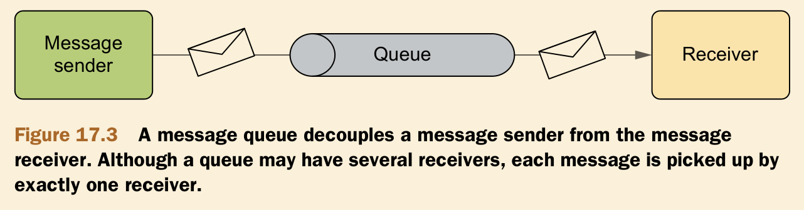
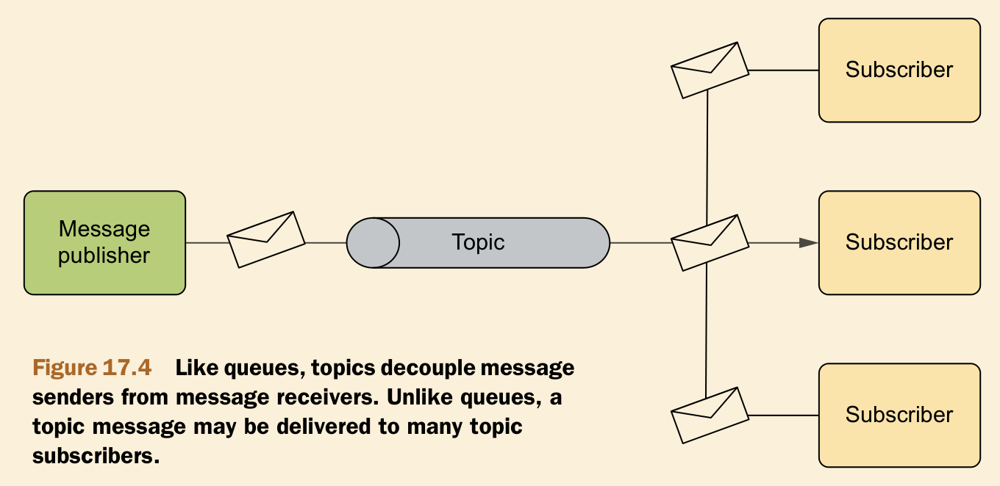
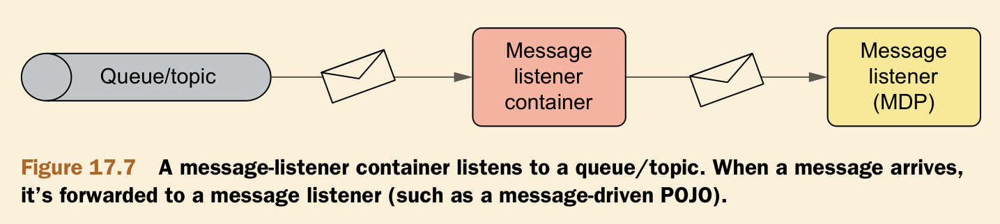
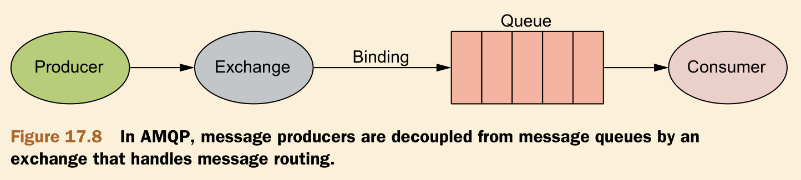

# Ch17 Messaging in Spring

- Introduction to asynchronous messaging
- Messaging with JMS
- Sending messages with Spring and AMQP
- Message-driven POJOs

## 17.1 Introduction to asynchronous messaging

Asynchronous message = message broker + destination

### 17.1.1 Two models of asynchronous messaging

1. Point-to-Point



2. Publisher-Subscribe



### 17.1.2 Advantages of asynchronous messaging

1. Synchronous communication implies waiting.
2. The client is coupled to the service through the service’s interface.
3. The client is coupled to the service’s location.
4. The client is coupled to the service’s availability.

## 17.2 Sending messages with JMS

### 17.2.0 Introduction to JMS

The Java Message Service (JMS) is a Java standard that defines a common API for working with message brokers.

### 17.2.1 Config files

```xml
<dependency>
    <groupId>org.apache.activemq</groupId>
    <artifactId>activemq-all</artifactId>
    <version>5.10.0</version>
</dependency>

<dependency>
    <groupId>org.springframework</groupId>
    <artifactId>spring-jms</artifactId>
    <version>${spring-version}</version>
</dependency>
```

1. ActiveMQConnectionFactory

```java
@Bean
public ActiveMQConnectionFactory connectionFactory() {
    ActiveMQConnectionFactory connectionFactory = new ActiveMQConnectionFactory();
    connectionFactory.setBrokerURL("tcp://localhost:61616");
    return connectionFactory;
}
```

2. Destination : Queue / Topic

```java
@Bean
public ActiveMQQueue activemqQueue() {
    return new ActiveMQQueue("spitter.alert.queue");
}
```

3. JmsTemplate

```java
@Bean
public JmsTemplate jmsTemplate(ActiveMQConnectionFactory connectionFactory,
                               ActiveMQQueue activemqQueue,
                               @Qualifier("simpleMessageConverter") MessageConverter messageConverter) {
    JmsTemplate jmsTemplate = new JmsTemplate(connectionFactory);
    jmsTemplate.setDefaultDestination(activemqQueue);
    jmsTemplate.setMessageConverter(messageConverter);
    return jmsTemplate;
}
```

4. MessageConverter

```java
@Bean
@Qualifier("simpleMessageConverter")
public MessageConverter simpleMessageConverter() {
    return new SimpleMessageConverter();
}
```

### 17.2.2 Sending Messages

```java
@Override
public void sendMessage(String message) {
    jmsOperations.convertAndSend(message);
}
```

### 17.2.3 Receiving Messages

```java
@Override
public void receiveMessage() {
    Spittle message = (Spittle)jmsOperations.receiveAndConvert();
    System.out.println(message);
}
```

## 17.3 message-driven POJO and Message-Listener (Receiving Messages)

However, the big downside of consuming messages with JmsTemplate is that both the receive() and receiveAndConvert() methods are synchronous. So we need message-driven POJO and Listener.

### 17.3.1 Creating message-driven POJO

MDB : Message Driven Bean



#### Method 1

```java
@Bean
public MessageListenerContainer messageListenerContainer() {
    DefaultMessageListenerContainer container = new DefaultMessageListenerContainer();
    container.setConnectionFactory(connectionFactory());
    container.setDestination(activemqQueue());
    container.setMessageListener(messageListener());
    container.setMessageConverter(simpleMessageConverter());
    return container;
}

@Bean
public MessageListener messageListener() {
    return new JmsListener();
}

public class JmsListener implements MessageListener {
    @Override
    public void onMessage(Message message) {
        if (message instanceof ActiveMQTextMessage) {
            try {
                ActiveMQTextMessage message1 = (ActiveMQTextMessage) message;
                String messageText = message1.getText();
                System.out.println("Message received: " + messageText);
            } catch (JMSException e) {
                throw JmsUtils.convertJmsAccessException(e);
            }
        } else {
            throw new IllegalArgumentException("Message is not a TextMessage");
        }
    }
}
```

#### Method 2 : Spring JMS Listener

```java
@Bean
public SimpleJmsListenerContainerFactory jmsListenerContainerFactory(
        ActiveMQConnectionFactory connectionFactory,
        @Qualifier("simpleMessageConverter") MessageConverter messageConverter) {
    SimpleJmsListenerContainerFactory factory = new SimpleJmsListenerContainerFactory();
    factory.setConnectionFactory(connectionFactory);
    factory.setMessageConverter(messageConverter);
    return factory;
}

@JmsListener(destination = "spitter.alert.queue")
public void receiveMessage(final Message message) {

    if (message instanceof ActiveMQTextMessage) {
        try {
            ActiveMQTextMessage message1 = (ActiveMQTextMessage) message;
            String messageText = message1.getText();
            System.out.println("Message received: " + messageText);
        } catch (JMSException e) {
            throw JmsUtils.convertJmsAccessException(e);
        }
    } else {
        throw new IllegalArgumentException("Message is not a TextMessage");
    }
}
```

## 17.4 Messaging with AMQP

### 17.4.0 Why need AMQP (Advantages)

1. JMS’s API specification ensures that all JMS implementations can be used through a common API but doesn’t ensure that messages sent by one JMS implementation can be consumed by a different JMS implementation. AMQP’s wire-level protocol, on the other hand, specifies the format that messages will take when routing between the producer and consumer. Consequently, AMQP is more interoperable than JMS--not only across different AMQP implementations, but also across languages and platforms.
2. Another significant advantage is that AMQP has a much more flexible and transparent messaging model. With JMS, there are only two messaging models to choose from: point-to-point and publish/subscribe. Both of those models are certainly possible with AMQP, but AMQP enables you to route messages in a number of ways, and it does this by decoupling the message producer from the queue(s) in which the messages will be placed.

### 17.4.1 Introduction to AMQP



More information about amqp models can be found in [rabbitmq-docs](https://www.rabbitmq.com/docs)

### 17.4.2 AMQP Messaging with Spring

```xml
<dependency>
   <groupId>org.springframework.amqp</groupId>
   <artifactId>spring-amqp</artifactId>
   <version>1.7.5.RELEASE</version>
</dependency>

<dependency>
   <groupId>org.springframework.amqp</groupId>
   <artifactId>spring-rabbit</artifactId>
   <version>1.7.5.RELEASE</version>
</dependency>
```

### 17.4.3 Config files

1. ConnectFactory

```java
@Bean
 public ConnectionFactory connectionFactory() {
     CachingConnectionFactory connectionFactory = new CachingConnectionFactory();
     connectionFactory.setHost("113.45.134.208");
     connectionFactory.setPort(5672);
     connectionFactory.setUsername("");
     connectionFactory.setPassword("");
     return connectionFactory;
 }
```

2. Consumer Destination

```java
@Bean
 public Queue queue() {
     return new Queue(QUEUE_NAME);
 }
```

3. RabbitTemplate

```java
 @Bean
 public RabbitTemplate rabbitTemplate() {
     RabbitTemplate rabbitTemplate = new RabbitTemplate(connectionFactory());
     rabbitTemplate.setMessageConverter(messageConverter());
     return rabbitTemplate;
 }
```

4. MessageConverter

```java
@Bean
 public MessageConverter messageConverter() {
     return new SimpleMessageConverter();
 }
```

### 17.4.4 Sending Messages

```java
@Override
 public void sendMessage(String message) {
     rabbitOperations.convertAndSend(EXCHANGE_NAME, ROUTING_KEY, message);
 }
```

#### Receiving Messages

```java
@Override
public Spittle receiveMessage() {
    Spittle spittle = (Spittle) rabbitOperations.receiveAndConvert(QUEUE_NAME);
    return spittle;
}
```

## 17.5 message-driven POJO and Message-Listener (Receiving Messages)

However, the big downside of consuming messages with JmsTemplate is that both the receive() and receiveAndConvert() methods are synchronous. So we need message-driven POJO and Listener.

### 17.5.1 Creating message-driven POJO

MDB : Message Driven Bean


#### Method 1

```java
 @Bean
 public MessageListenerContainer messageListenerContainer() {
     SimpleMessageListenerContainer container = new SimpleMessageListenerContainer();
     container.setConnectionFactory(connectionFactory());
     container.setQueues(queue());
     container.setMessageListener(messageListener());
     return container;
 }

 @Bean
 public MessageListener messageListener() {
     return new AmqpListener();
 }
 
public class AmqpListener implements MessageListener {
   @Override
   public void onMessage(Message message) {
      String s = new String(message.getBody(), StandardCharsets.US_ASCII);
      System.out.println(s);
   }
}
```

#### Method 2 : Spring Rabbit Listener

```java
@Bean
public RabbitListenerContainerFactory rabbitListenerContainerFactory() {
    SimpleRabbitListenerContainerFactory containerFactory = new SimpleRabbitListenerContainerFactory();
    containerFactory.setConnectionFactory(connectionFactory());
    containerFactory.setMessageConverter(messageConverter());
    return containerFactory;
}


@RabbitListener(bindings = @QueueBinding(
        value = @Queue(QUEUE_NAME),
        exchange = @Exchange(value = EXCHANGE_NAME, type = ExchangeTypes.DIRECT), key = ROUTING_KEY)
)
public void receiveMessage(Message message) {
   String s = new String(message.getBody(), StandardCharsets.US_ASCII);
   System.out.println(s);
}
```