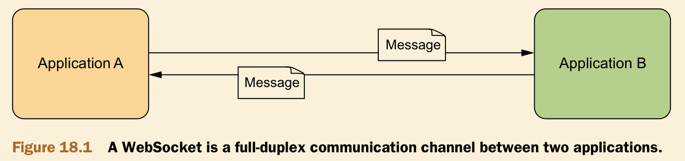
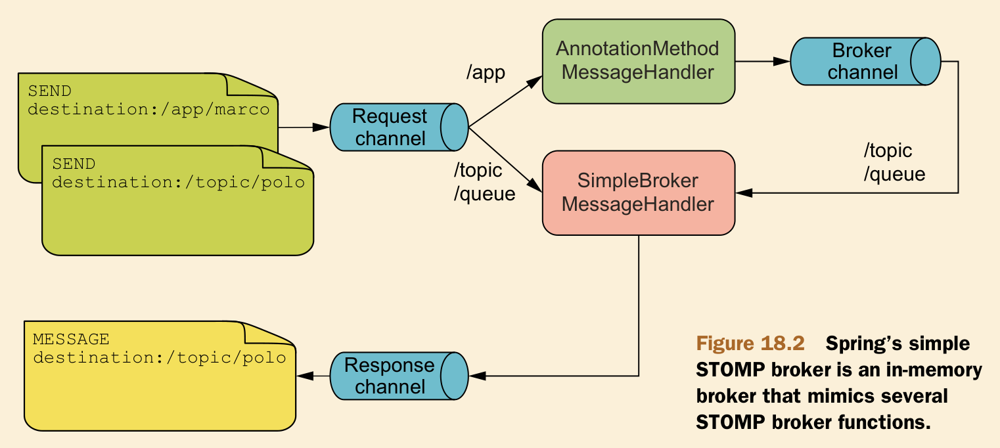

# Ch18 Messaging with Websocket and STOMP

- Sending messages between browser and server
- Handler messages in Spring MVC Controllers
- Sending user-targeted messages

## 18.1 Working with Spring’s low-level WebSocket API

WebSocket is a protocol providing full-duplex communication across a single socket. It enables asynchronous messaging between a web browser and a server.



### 18.1.1 Config WebSocket

```xml
<dependency>
    <groupId>org.springframework</groupId>
    <artifactId>spring-websocket</artifactId>
    <version>${spring-version}</version>
</dependency>

<dependency>
    <groupId>org.springframework</groupId>
    <artifactId>spring-messaging</artifactId>
    <version>${spring-version}</version>
</dependency>
```

WebMvcConfig + WebSocketConfig

```java
@EnableWebSocket
@Configuration
public class WebSocketConfig implements WebSocketConfigurer {

    @Override
    public void registerWebSocketHandlers(WebSocketHandlerRegistry registry) {
        // Map MarcoHandler to “/marco”
        registry.addHandler(webSocketHandler(), "/marco");
    }

    @Bean
    public WebSocketHandler webSocketHandler() {
        return new MarcoHandler();
    }
}
```

### 18.1.2 Handle text message in WebSocketHandler

```java
public class MarcoHandler extends AbstractWebSocketHandler {
    @Override
    protected void handleTextMessage(WebSocketSession session, TextMessage message) throws Exception {
        System.out.println(message.getPayload());
        Thread.sleep(2000L);
        session.sendMessage(new TextMessage("Polo"));
    }

    @Override
    public void afterConnectionEstablished(WebSocketSession session) throws Exception {
        System.out.println("Connection established");
    }

    @Override
    public void afterConnectionClosed(WebSocketSession session, CloseStatus status) throws Exception {
        System.out.println("Connection closed");
    }
}
```

### 18.1.3 JavaScript Client

```html
<html>
  <head>
    <title>Home</title>
  </head>
  <body>
    <button id="stop">Stop</button>

    <script th:inline="javascript">
      var url = 'ws://localhost:8080/websocket/marco';
      var sock = new WebSocket(url);

      sock.onopen = function() {
        console.log('Opening');
        sayMarco();
      };

      sock.onmessage = function(e) {
        console.log('Received message: ', e.data);
        setTimeout(function(){sayMarco()}, 2000);
      };

      sock.onclose = function() {
        console.log("Closing");
      };

      function sayMarco() {
        console.log('Sending Marco!');
        sock.send("Marco!");
      }
    </script>

    <div id="output"></div>
  </body>
</html>
```

## 18.2 Working with STOMP messaging

```xml
<dependency>
    <groupId>org.springframework</groupId>
    <artifactId>spring-websocket</artifactId>
    <version>${spring-version}</version>
</dependency>

<dependency>
    <groupId>org.springframework</groupId>
    <artifactId>spring-messaging</artifactId>
    <version>${spring-version}</version>
</dependency>

<dependency>
    <groupId>org.webjars</groupId>
    <artifactId>stomp-websocket</artifactId>
    <version>2.3.0</version>
</dependency>

<dependency>
    <groupId>com.fasterxml.jackson.core</groupId>
    <artifactId>jackson-databind</artifactId>
    <version>2.13.4.2</version>
</dependency>
```

### 18.2.1 Introduction to STOMP

### 18.2.2 Config simple STOMP broker



```java
@EnableWebSocketMessageBroker
@Configuration
public class StompConfig extends AbstractWebSocketMessageBrokerConfigurer {
    @Override
    public void registerStompEndpoints(StompEndpointRegistry registry) {
        registry.addEndpoint("/marcopolo");
    }

    @Override
    public void configureMessageBroker(MessageBrokerRegistry registry) {
        registry.enableSimpleBroker("/queue", "/topic");
        registry.setApplicationDestinationPrefixes("/app");
    }

    @Bean
    public MessageConverter messageConverter() {
        // config converter for json message
        return new MappingJackson2MessageConverter();
    }
}
```

### 18.2.3 Handle message in Controller

@MessageMapping + @SendTo

```java
@Controller
public class MarcoController {
    @MessageMapping("/marco") // imply /app/marco
    @SendTo("/topic/shout")
    public Shout handleShout(Shout shout) {
        System.out.println("Recieved Message: " + shout.getMessage());
        Shout outGoing = new Shout("Polo!");
        return outGoing;
    }
}
```

### 18.2.4 JavaClient

```javascript
var url = 'ws://' + window.location.host + '/stomp/marcopolo';
var sock = new WebSocket(url);
var stomp = Stomp.over(sock);
```


### 18.2.5 RelayBroker (Not Implement)

### 18.3 Working with user-targeted messages (Not Implement)

### 18.4 Handling message exceptions (Not Implement)

```java
@MessageExceptionHandler(
        {SpittleException.class, DatabaseException.class})
public void handleExceptions(Throwable t) {
    logger.error("Error handling message: " + t.getMessage());
}

@MessageExceptionHandler(SpittleException.class)
@SendToUser("/queue/errors")
public SpittleException handleExceptions(SpittleException e) {
    logger.error("Error handling message: " + e.getMessage());
    return e;
}
```