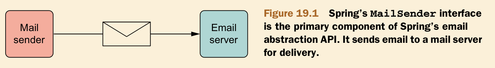

# Ch19 Sending email with Spring

- Configuring Spring’s email abstraction
- Sending rich email messages
- Using templates to construct email messages

## 19.1 Configuring Spring to send mail



### 19.1.1 Config MailSender

```xml
<dependencies>
    <dependency>
        <groupId>javax.mail</groupId>
        <artifactId>mail</artifactId>
        <version>1.4.7</version>
    </dependency>

    <dependency>
        <groupId>org.springframework</groupId>
        <artifactId>spring-context-support</artifactId>
        <version>${spring-version}</version>
    </dependency>

    <dependency>
        <groupId>org.thymeleaf</groupId>
        <artifactId>thymeleaf-spring4</artifactId>
        <version>3.0.9.RELEASE</version>
    </dependency>
</dependencies>
```

```java
@Configuration
@PropertySource(value = "classpath:email.properties")
public class EmailConfig {

    @Value("${email.username}")
    private String emailUsername;

    @Value("${email.password}")
    private String emailPassword;

    @Bean
    public JavaMailSender mailSender() {
        JavaMailSenderImpl mailSender = new JavaMailSenderImpl();
        mailSender.setHost("smtp.qq.com");
        mailSender.setPort(587);
        mailSender.setUsername(emailUsername);
        mailSender.setPassword(emailPassword);
        return mailSender;
    }

    @Bean
    public SpitterEmailService emailService(JavaMailSender mailSender) {
        return new SpitterEmailServiceImpl(mailSender);
    }
}
```

### 19.1.2 Sending mail with MailSender

```java
public class SpitterEmailServiceImpl implements SpitterEmailService {

    private final JavaMailSender mailSender;

    @Autowired
    public SpitterEmailServiceImpl(JavaMailSender mailSender) {
        this.mailSender = mailSender;
    }

    @Override
    public void sendSimpleSpitterEmail(String to, Spittle spittle) {
        String spitterName = spittle.getSpitter().getFullName();

        SimpleMailMessage message = new SimpleMailMessage();
        message.setFrom("2495716508@qq.com");
        message.setTo(to);
        message.setSubject("New Spittle from " + spitterName);
        message.setText(spitterName + " says: " + spittle.getMessage());

        mailSender.send(message);
    }
}
```

## 19.2 Constructing email messages with attachment

```java
@Override
public void sendMimeEmailWithAttachments(String to, Spittle spittle) {
    MimeMessage message = mailSender.createMimeMessage();
    try {
        MimeMessageHelper helper = new MimeMessageHelper(message, true);
        helper.setFrom("2495716508@qq.com");
        helper.setTo(to);
        helper.setSubject("New Spittle from " + spittle.getMessage());
        helper.setText(spittle.getMessage());

        ClassPathResource coupleImage = new ClassPathResource("/collateral/coupon.jpg");
        helper.addAttachment("coupon.jpg", coupleImage);
    } catch (MessagingException e) {
        throw new RuntimeException(e);
    }

    mailSender.send(message);
}
```

## 19.3 Sending email with template

### 19.3.1 Adding Config

```java
@Bean
public ClassLoaderTemplateResolver emailTemplateResolver() {
    ClassLoaderTemplateResolver templateResolver = new ClassLoaderTemplateResolver();
    templateResolver.setPrefix("/mail-template/");
    templateResolver.setTemplateMode(TemplateMode.HTML);
    templateResolver.setCharacterEncoding("UTF-8");
    templateResolver.setOrder(1);
    return templateResolver;
}

@Bean
public SpringTemplateEngine springTemplateEngine() {
    SpringTemplateEngine templateEngine = new SpringTemplateEngine();
    templateEngine.setTemplateResolver(emailTemplateResolver());
    return templateEngine;
}
```

### 19.3.2 Implementing Sending with Template

```java
@Override
public void sendEmailWithTemplate(String to, Spittle spittle) {
    Context context = new Context();
    context.setVariable("spitterName", spittle.getSpitter().getFullName());
    context.setVariable("spittleText", spittle.getMessage());
    context.setVariable("firefoxLogo", FIREFOX_LOGO_IMAGE);

    MimeMessage message = mailSender.createMimeMessage();
    try {
        MimeMessageHelper helper = new MimeMessageHelper(message, true);
        helper.setFrom("2495716508@qq.com");
        helper.setTo(to);
        helper.setSubject("New Spittle from " + spittle.getMessage());
        String messageText = templateEngine.process("emailTemplate.html", context);
        helper.setText(messageText);

        ClassPathResource resource = new ClassPathResource(FIREFOX_LOGO_IMAGE);
        helper.addInline("firefoxLogo", resource);
    } catch (MessagingException e) {
        throw new RuntimeException(e);
    }

    mailSender.send(message);
}
```

```html
<!DOCTYPE html>
<html xmlns:th="http://www.thymeleaf.org">
<body>

<h4><span th:text="${spitterName}">Craig Walls</span> says...</h4>
<i><span th:text="${spittleText}">Hello there!</span></i>
</body>
</html>
```