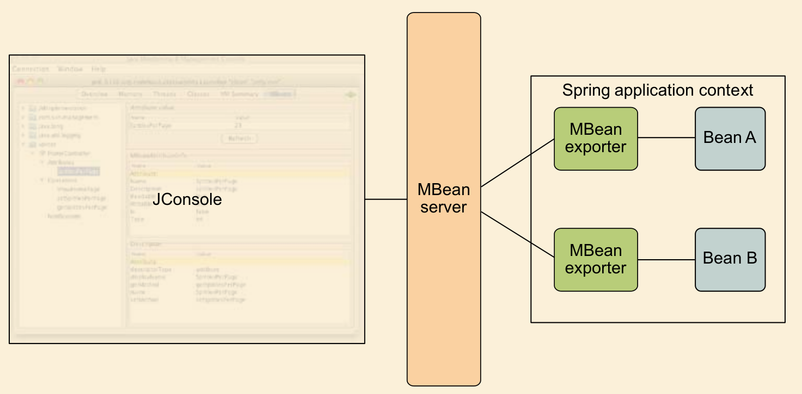

# Ch20 Managing Spring Beans with JMX

- Exposing Spring beans as managed beans
- Remotely managing Spring beans 
- Listening and handling JMX notifications

Spring’s support for DI is a great way to configure bean properties in an applica-
tion. But once the application has been deployed and is running, DI alone can’t do
much to help you change that configuration. Suppose you want to dig into a run-
ning application and change its configuration on the fly. That’s where Java Manage-
ment Extensions (JMX) comes in.

JMX is a technology that enables you to instrument applications for manage-
ment, monitoring, and configuration.

The key component of an application that’s instrumented for management with
JMX is the managed bean (MBean). An MBean is a JavaBean that exposes certain
methods that define the management interface. The JMX specification defines four
types of MBeans:
    - Standard MBeans—MBeans whose management interface is determined by
reflection on a fixed Java interface that’s implemented by the bean class.
    - Dynamic MBeans—MBeans whose management interface is determined at run-
time by invoking methods of the DynamicMBean interface. Because the manage-
ment interface isn’t defined by a static interface, it can vary at runtime.
    - Open MBeans—A special kind of dynamic MBean whose attributes and opera-
tions are limited to primitive types, class wrappers for primitive types, and any
type that can be decomposed into primitives or primitive wrappers.
    - Model MBeans—A special kind of dynamic MBean that bridges a management
interface to the managed resource. Model MBeans aren’t written as much as
they are declared. They’re typically produced by a factory that uses some meta-
information to assemble the management interface.

## 20.1 Exporting Spring beans as MBeans

What we need to do next is expose the SpittleController bean as
an MBean. Then the spittlesPerPage property will be exposed as the MBean’s man-
aged attribute, and you’ll be able to change its value at runtime.
Spring’s MBeanExporter is the key to JMX-ifying beans in Spring. MBeanExporter is
a bean that exports one or more Spring-managed beans as model MBeans in an MBean server. An MBean server (sometimes called an MBean agent) is a container
where MBeans live and through which the MBeans are accessed.



```java
@Configuration
public class JmxConfig {

    @Autowired
    private SpittleController spittleController;

    @Bean
    public MBeanExporter exporter() {
        MBeanExporter exporter = new MBeanExporter();
        Map<String, Object> beans = new HashMap<>();
        beans.put("spitter:name=SpittleController", spittleController);
        exporter.setBeans(beans);
        return exporter;
    }
}
```

To gain finer control over an MBean’s attributes and operations, Spring offers a
few options, including the following:
  - Declaring bean methods that are to be exposed/ignored by name
  - Fronting the bean with an interface to select the exposed methods
  - Annotating the bean to designate managed attributes and operations

#### From whence the MBean server?

As configured, MBeanExporter assumes that it’s running in an application server
(such as Tomcat) or some other context that provides an MBean server. But if your
Spring application will be running standalone or in a container that doesn’t provide
an MBean server, you’ll want to configure an MBean server in the Spring context.
MBeanServerFactoryBean creates an MBean server as a bean in the Spring appli-
cation context. By default, that bean’s ID is mbeanServer. Knowing this, you can wire
it into MBeanExporter’s server property to specify which MBean server an MBean
should be exposed through.

### 20.1.1 Exposing methods by name

#### Method 1

```java
@Bean
public MethodNameBasedMBeanInfoAssembler mBeanInfoAssembler() {
    MethodNameBasedMBeanInfoAssembler mBeanInfoAssembler = new MethodNameBasedMBeanInfoAssembler();
    mBeanInfoAssembler.setManagedMethods(
            "getSpittlesPerPage", "setSpittlesPerPage"
    );
    return mBeanInfoAssembler;
}
```

#### Method2 : Reversed approach

```java
@Bean
public MethodExclusionMBeanInfoAssembler exclusionMBeanInfoAssembler () {
    MethodExclusionMBeanInfoAssembler exclusionMBeanInfoAssembler = new MethodExclusionMBeanInfoAssembler();
    exclusionMBeanInfoAssembler.setIgnoredMethods("spittles");
    return exclusionMBeanInfoAssembler;
}
```

### 20.1.2 Using interfaces to define MBean operations and attributes

```java
@Bean
public InterfaceBasedMBeanInfoAssembler mBeanInfoAssembler() {
    InterfaceBasedMBeanInfoAssembler mBeanInfoAssembler = new InterfaceBasedMBeanInfoAssembler();
    mBeanInfoAssembler.setManagedInterfaces(SpittleControllerManagedOperation.class);
    return mBeanInfoAssembler;
}
```

### 20.1.3 Working with annotation-driven MBeans (Not Implementation)

```java
@Controller
public class SpittleController {
    public static final int DEFAULT_SPITTLES_PER_PAGE = 25;
    private int spittlesPerPage = DEFAULT_SPITTLES_PER_PAGE;

    @ManagedAttribute
    public int getSpittlesPerPage() {
        return spittlesPerPage;
    }

    @ManagedAttribute
    public void setSpittlesPerPage(int spittlesPerPage) {
        this.spittlesPerPage = spittlesPerPage;
    }

    @ManagedOperation
    public int countSpittles() {
        return 0;
    }
}
```

### 20.1.4 Handling MBean collisions

There are three ways to handle an MBean name collision via the registration-
Policy property:
- FAIL_ON_EXISTING—Fail if an existing MBean has the same name (this is the
default behavior).
- IGNORE_EXISTING—Ignore the collision and don’t register the new MBean.
- REPLACING_EXISTING—Replace the existing MBean with the new MBean.

```java
@Bean
public MBeanExporter exporter() {
    MBeanExporter exporter = new MBeanExporter();
    Map<String, Object> beans = new HashMap<>();
    beans.put("spitter:name=SpittleController", spittleController);
    exporter.setBeans(beans);
    exporter.setAssembler(mBeanInfoAssembler());
    exporter.setRegistrationPolicy(RegistrationPolicy.IGNORE_EXISTING);
    return exporter;
}
```

## 20.2 Remoting MBeans

